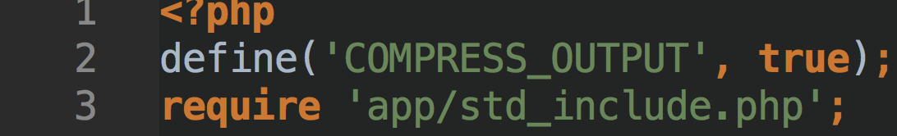
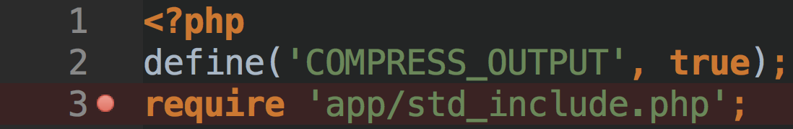
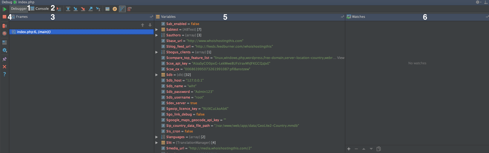

## What is Xdebug?

Xdebug is a PHP extension that allows Just In Time debugging to PHP applications.  PHPStorm has excellent Xdebug
handling capabilities and this is what we will explore.

## Getting started with Xdebug via PHPStorm

## Get the bookmarklets

You can get these from https://www.jetbrains.com/phpstorm/marklets/.

* Set an Xdebug IDE key, normally PHPSTORM for simple configurations    <!-- .element: class="fragment" data-fragment-index="1" -->
* Hit Generate.                                                         <!-- .element: class="fragment" data-fragment-index="2" -->
* In chrome drag and drop the generated links onto your bookmark bar.   <!-- .element: class="fragment" data-fragment-index="3" -->

## Invoking the debugger

1. In your browser click the 'Start Debugger' bookmark.
1. In PHPStorm turn on the telephone :)

 

## Setting breakpoints

Within PHPStorm setting a breakpoint is done on the left hand side of the editor window.

                                    <!-- .element: class="fragment" data-fragment-index="1" -->
                                      <!-- .element: class="fragment" data-fragment-index="2" -->

Refresh the web browser and you will see Xdebug break at your breakpoint.<!-- .element: class="fragment" data-fragment-index="2" -->

## Notes on Setting Breakpoints

You cannot set a breakpoint on:
* Non php code
* Braces
* Funtions
* Method Signatures

## The PHPStorm Debugger

1. Debug Toolbar
2. Debugger Tab
3. Debugger Console Tab
4. Frame Window (Stack trace or code flow)
5. Variables within the current scope
6. Watched Variables

## 1. The Debug Toolbar

* Play, Pause
* Stop
* View Breakpoints
* Mute Breakpoints
* Restore Layout
* Settings
* Pin Tab
* Close
* Help

## 2. The Debugger Tab

This is the main container for Frames (Stack traces), Variables and Watches

## 3. The Debugger Console

No idea, I never use this! (Well once, for this presentation)
At first switch off show by default

## 4. Frames and Stack Traces

### The heart of the debugging system
Here you can:
* Select any point in the current execution flow
* Variables at that point in time
* See how the stack of calls work throughout the request

## 5. Variables & Scope

### The lungs of the debugging system
* Inspect variables and their types
* Drill down into complex objects
* Copy values of variables (e.g. SQL statements)

## 6. Watching Variables

* Allows viewing of variables, expressions or parts of an object or array
* Easy insight into specific variables of interest

## Complex Debugging

### Using The Stack To Your Advantage

* Conditional Breakpoints
* Using the Console

## Stepping through code

* Step Over
* Step Into
* Play until the next breakpoint

## Any Questions?

## Thank You

Simon Griffiths ([email](mailto:simon.griffiths@dvomedia.net))
or @sigriffiths_ on [Twitter](http://twitter.com/sigriffiths_)
or sigriffiths on [Github](https://github.com/sigriffiths)
