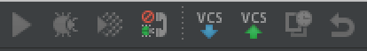

## What is Xdebug?

Xdebug is a PHP extension that allows Just In Time debugging to PHP applications.  PHPStorm has excellent Xdebug
handling capabilities and this is what we will explore.

## Getting started with Xdebug

## Get the bookmarklets

You can get these from https://www.jetbrains.com/phpstorm/marklets/.

* Set an Xdebug IDE key, normally PHPSTORM for simple configurations    <!-- .element: class="fragment" data-fragment-index="1" -->
* Hit Generate.                                                         <!-- .element: class="fragment" data-fragment-index="2" -->
* In chrome drag and drop the generated links onto your bookmark bar.   <!-- .element: class="fragment" data-fragment-index="3" -->

## Invoking the debugger

1. In your browser click the 'Start Debugger' bookmark.
1. In PHPStorm turn on the telephone :)

 

## Setting breakpoints

Within PHPStorm setting a breakpoint is done on the left hand side of the editor window.

                                    <!-- .element: class="fragment" data-fragment-index="1" -->
                                      <!-- .element: class="fragment" data-fragment-index="2" -->

Refresh the web browser and you will see Xdebug break at your breakpoint.<!-- .element: class="fragment" data-fragment-index="2" -->

## The PHPStorm Debug Tab

